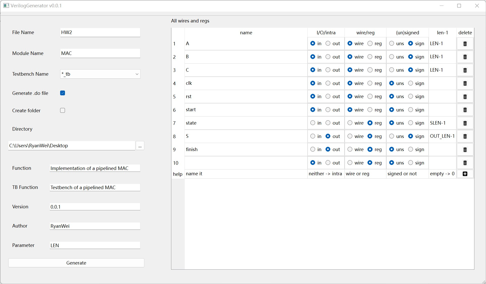

# Verilog Generator

## Features

Example:

- Can generate formatted verilog module (*foo.v*), testbench (*foo_tb.v*), and do file for ModelSim (*foo.do*)
- The generated verilog has header, module(...), and a basic testbench template.
- All info in this GUI is stored in *log.dat* per exit and reloaded at the next program initialization. So accidentally exiting the program will not lose data.
- Other convenient features including: "file overwriting" warning, easy input-output modification, ... You'll feel it while using.

## Advanced Topic

- The source code is compiled by Qt >= 5.14.
- The template of verilog module and testbench is in [def.cpp](def.cpp), which can be modified if needed (but needs recompile).

## License

This project is licensed under the MIT License - see the [LICENSE](LICENSE) file for details.
